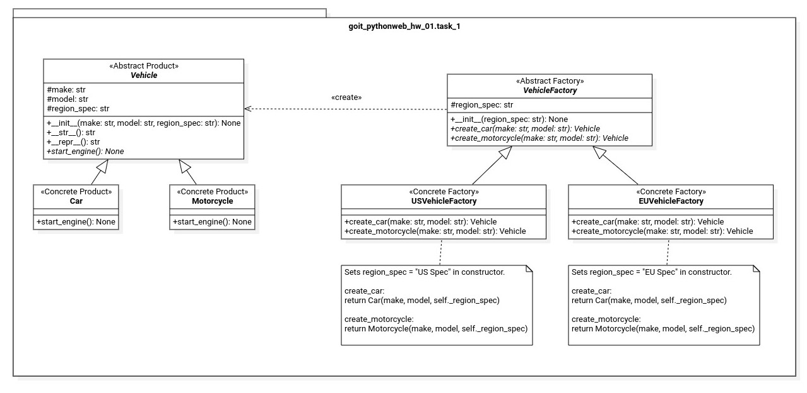
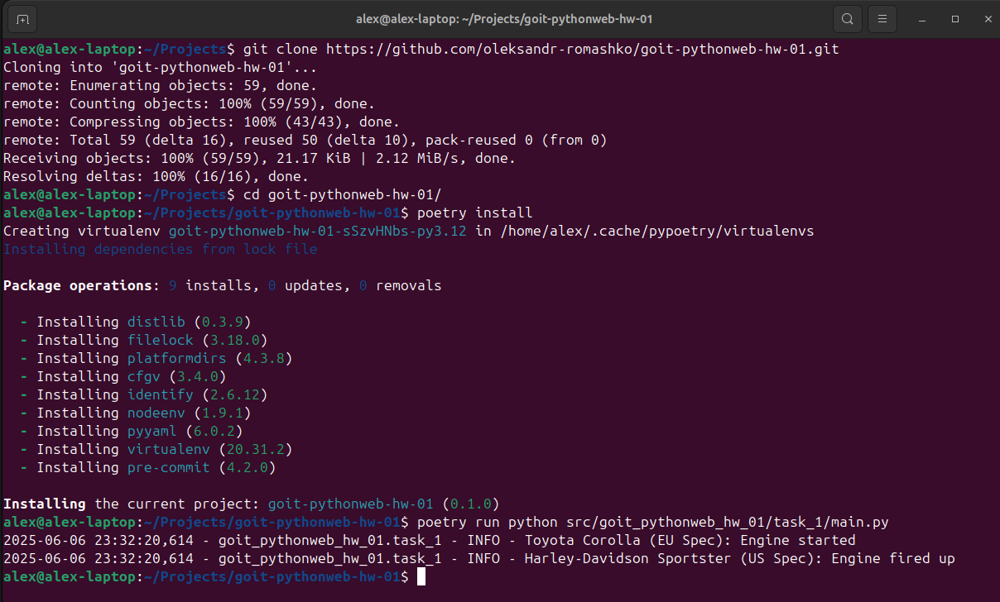
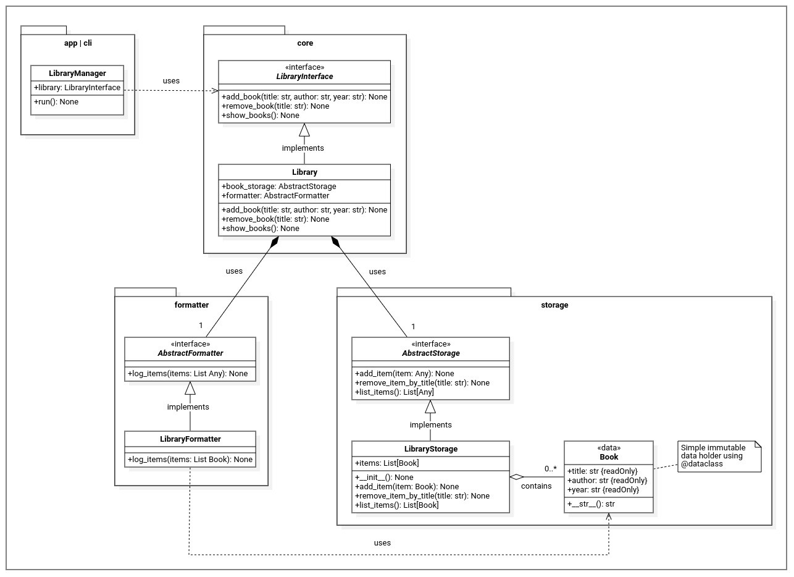
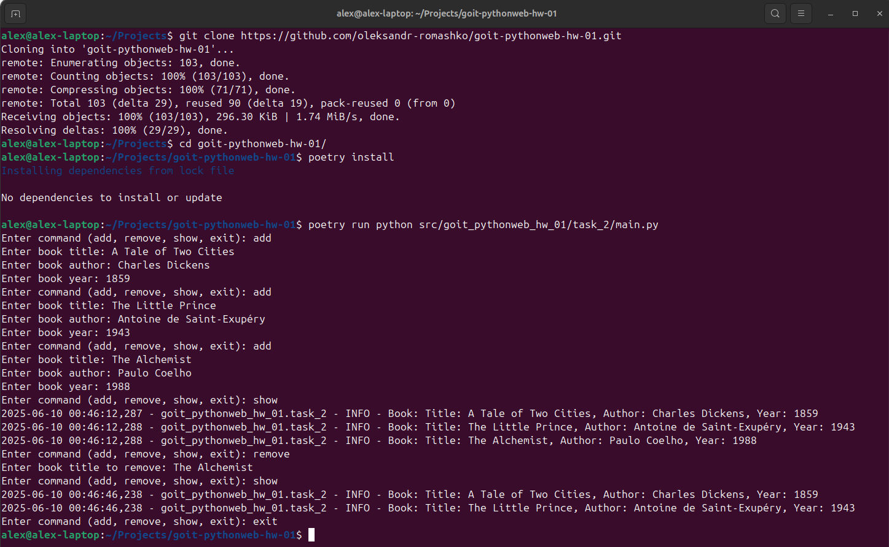

# Fullstack Web Development with Python <!-- omit in toc -->

### [# goit-pythonweb-hw-01](https://github.com/topics/goit-pythonweb-hw-01) <!-- omit in toc -->

<p align="center">
  
</p>


## Design patterns, SOLID principles, logging, code formatting using black <!-- omit in toc -->

This work consists of two tasks focused on applying key programming principles in Python.

1. **Task 1 – Factory Pattern:**
    Refactor a basic vehicle creation system using the Factory design pattern. The goal is to support region-specific specifications (e.g., US Spec, EU Spec) without modifying the core vehicle classes.
2. **Task 2 – SOLID Principles:**
    Redesign a simple command-line library management program to follow SOLID principles. The task involves introducing appropriate abstractions and interfaces to make the system more modular, extensible, and maintainable.

Both tasks require:
* The use of **type hints** for type safety.
* **INFO-level logging** instead of print statements.
* Code formatting with **Black**.

### Project Setup & Run Instructions

#### Prerequisites

Before starting, ensure that you have the following installed:

* **Python 3.10+** (tested with 3.12.3)
* **pip** (Python package manager)
* (Optional) Git for cloning the repo
* (Optional) VS Code with Python and Black extensions

#### Setting Up the Development Environment

1. **Clone the Repository**

    If you haven't cloned the project yet, you can do so using:

    ```bash
    git clone https://github.com/oleksandr-romashko/goit-pythonweb-hw-01.git
    cd goit-pythonweb-hw-01
    ```

    Or download the ZIP archive from [GitHub Repository](https://github.com/oleksandr-romashko/goit-pythonweb-hw-01) and extract it.

2. **Create a Virtual Environment**
   
    **Linux/macOS**

    ```bash
    python3 -m venv .venv
    source .venv/bin/activate
    pip install -r requirements.txt
    ```

    **Windows**

    ```cmd
    python -m venv .venv
    .venv\Scripts\activate
    pip install -r requirements.txt
    ```

#### Running the Code

**Task 1 (Factory Pattern)**

```bash
python src/task_1/main.py
```

**Task 2 (SOLID Principles)**

```cmd
python src/task_2/main.py
```


### Task requirements

#### Task 1: Factory Pattern

##### Task description

The following code demonstrates a simple system for creating vehicles. We have two classes: `Car` and `Motorcycle`. Each class has a `start_engine()` method that simulates starting the engine of the respective vehicle. Currently, to create a new vehicle, we simply instantiate the corresponding class with a specified `make` and `model`.

```python
class Car:
    def __init__(self, make, model):
        self.make = make
        self.model = model

    def start_engine(self):
        print(f"{self.make} {self.model}: Engine started")

class Motorcycle:
    def __init__(self, make, model):
        self.make = make
        self.model = model

    def start_engine(self):
        print(f"{self.make} {self.model}: Engine started")

# Usage
vehicle1 = Car("Toyota", "Corolla")
vehicle1.start_engine()

vehicle2 = Motorcycle("Harley-Davidson", "Sportster")
vehicle2.start_engine()

```

Next, we need to create vehicles that account for regional specifications — for example, US Spec and EU Spec.

The task is to implement the `Factory pattern`, which allows creating vehicles with different regional specifications without modifying the core vehicle classes.

##### Steps for Task 1

1. Create an abstract base class `Vehicle` with a `start_engine()` method.
2. Update the `Car` and `Motorcycle` classes to inherit from Vehicle.
3. Create an abstract class `VehicleFactory` with methods `create_car()` and `create_motorcycle()`.
4. Implement two factory classes: `USVehicleFactory` and `EUVehicleFactory`. These factories should create vehicles labeled with the appropriate regional spec, for example, `Ford Mustang (US Spec)` for the US.
5. Refactor the initial code to use these factories for creating vehicles.

##### Expected Result

* Code that makes it easy to create vehicles for different regions using the appropriate factory.

#### Task 2: SOLID Principles

##### Task description

There is a simplified program for managing a library of books. The program allows adding new books, removing books, and displaying all books in the library. The user can interact with the program via command-line using commands: `add`, `remove`, `show`, and `exit`.

```python
class Library:
    def __init__(self):
        self.books = []

    def add_book(self, title, author, year):
        book = {
            "title": title,
            "author": author,
            "year": year
        }
        self.books.append(book)

    def remove_book(self, title):
        for book in self.books:
            if book["title"] == title:
                self.books.remove(book)
                break

    def show_books(self):
        for book in self.books:
            print(f'Title: {book["title"]}, Author: {book["author"]}, Year: {book["year"]}')

def main():
    library = Library()

    while True:
        command = input("Enter command (add, remove, show, exit): ").strip().lower()

        if command == "add":
            title = input("Enter book title: ").strip()
            author = input("Enter book author: ").strip()
            year = input("Enter book year: ").strip()
            library.add_book(title, author, year)
        elif command == "remove":
            title = input("Enter book title to remove: ").strip()
            library.remove_book(title)
        elif command == "show":
            library.show_books()
        elif command == "exit":
            break
        else:
            print("Invalid command. Please try again.")

if __name__ == "__main__":
    main()
```

The task is to rewrite this code following the SOLID principles.

##### Steps for Task 2

1. **Single Responsibility Principle (SRP)**: Create a `Book` class that is responsible for storing book information.
2. **Open/Closed Principle (OCP)**: Design the `Library` class so that it can be extended with new functionality without modifying its existing code.
3. **Liskov Substitution Principle (LSP)**: Ensure that any class inheriting from the `LibraryInterface` can replace the `Library` class without breaking the program.
4. **Interface Segregation Principle (ISP)**: Use a `LibraryInterface` to clearly specify the methods required to work with the library.
5. **Dependency Inversion Principle (DIP)**: High-level classes like `LibraryManager` should depend on abstractions (interfaces), not concrete implementations.

```python
from abc import ABC, abstractmethod

class Book:
    pass

class LibraryInterface(ABC):
    pass

class Library(LibraryInterface):
    pass

class LibraryManager:
    pass

def main():
    library = Library()
    manager = LibraryManager(library)

    while True:
        command = input("Enter command (add, remove, show, exit): ").strip().lower()

        match command:
            case "add":
                title = input("Enter book title: ").strip()
                author = input("Enter book author: ").strip()
                year = input("Enter book year: ").strip()
                manager.add_book(title, author, year)
            case "remove":
                title = input("Enter book title to remove: ").strip()
                manager.remove_book(title)
            case "show":
                manager.show_books()
            case "exit":
                break
            case _:
                print("Invalid command. Please try again.")

if __name__ == "__main__":
    main()
```


### Task Solution

##### Task 1 solution

Solution for this task is located in the following file:
* [task_1/main.py](./src/task_1/main.py) 



Application screenshot:



##### Task 2 solution

Solution for this task is located in the following file:
* [task_2/main.py](./src/task_2/main.py) 



Application screenshot:


